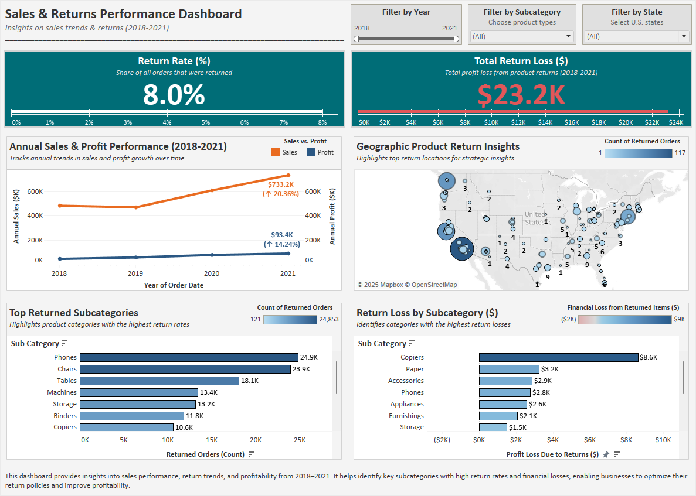

# 📌 Project 1 – Sales & Returns Performance Analysis

 
 
 
 

This project analyzes sales trends and return patterns to identify financial losses and optimize profitability. The dataset highlights key insights into high-return products, customer behavior, and regional return impact.

---

## Table of Contents 📚
- [Objectives](#objectives-)
- [Tools Used](#tools-used-)
- [Key Insights](#key-insights-)
- [Dashboard Preview](#dashboard-preview-)
- [Report Access](#report-access-)
- [Project Files & Instructions](#project-files--instructions-)
- [Conclusion & Recommendations](#conclusion--recommendations-)
- [Final Thoughts](#final-thoughts-)

---

## Table of Contents 📚
- Analyze return rate and financial loss from returned items
- Identify high-return product categories and segments
- Support decision-making to improve sales performance and reduce losses

---

## Tools Used 🛠️
- **Excel** – Data cleaning and calculated return metrics
- **Tableau** – Visual dashboard for insights and KPIs

---

## Key Insights 📈
- **$23K+ in profit lost** due to product returns
- **Top return categories**: Binders, Paper, Phones
- **Return Rate**: ~8% of all orders involved returns
- **High-loss regions**: California, Texas, and New York drove major return-related losses

---

## Dashboard Preview 📊

## Report Access 📄

- [📄 View Final Report (PDF)](./Sales_Returns_Performance_Analysis_Report.pdf)

---

## Project Files & Instructions 📂

| File Name                                         | Description                                                            |
|---------------------------------------------------|------------------------------------------------------------------------|
| `Sales_Returns_Performance_Analysis_Report.docx`  | Final project report with insights & recommendations                   |
| `Sales_Returns_Performance_Analysis_Report.pdf`   | Final project report with insights & recommendations                   |
| `Sales_Performance_Analysis_Dashboard.twbx`       | Tableau workbook for interactive exploration of the dashboard          |
| `Sales_Returns_Performance_Analysis_Dashboard.png`| Static image preview of the Tableau dashboard                          |
| `Cleaned_Sales_Performance_Dataset.xlsx`          | Cleaned dataset used for analysis (Excel format)                       |
| `Cleaned_Sales_Performance_Dataset.csv`           | Cleaned dataset in CSV format                                          |
| `README_Sales_Returns_Performance_Analysis.md`    | This README file                                                       |

---

## Conclusion & Recommendations 💡
- **Monitor & Reduce High-Return Products**: Improve quality and service for Binders, Paper, and Phones to minimize return impact.
- **Implement Location-Based Return Strategies**: Focus on California, Texas, and New York with revised policies and better product tracking.
- **Maximize Profitability**: Optimize inventory for low-return, high-margin categories like Copiers and Appliances.

---

## Final Thoughts 📝
This project demonstrates core capabilities expected of **Business Analysts**, **Operations Analysts**, and **CRM Specialists**—turning raw transaction data into actionable business insights. It demonstrates the ability to identify performance issues, support decision-making, and propose strategic improvements based on data.
