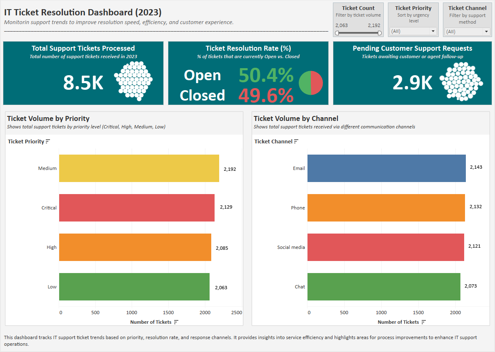

# IT Workflow & KPI Optimization | Excel + Tableau  

_Note: Also listed as “IT Workflow & KPI Optimization” on my resume and LinkedIn profile._

 
 
 
 

This project evaluates IT helpdesk ticket performance to uncover response delays, workload patterns, and improvement opportunities. The dataset highlights ticket status trends, resolution bottlenecks, and agent performance across various support channels.

---

## 📚 Table of Contents
- [Objectives](#objectives-)
- [Tools Used](#tools-used-)
- [Key Insights](#key-insights-)
- [Dashboard Preview](#dashboard-preview-)
- [Report Access](#report-access-)
- [Project Files & Instructions](#project-files--instructions-)
- [Conclusion & Recommendations](#conclusion--recommendations-)
- [Final Thoughts](#final-thoughts-)

---

## Objectives 🎯
- Analyze support ticket volume and resolution rates.
- Identify performance gaps by ticket type and priority.
- Recommend improvements to enhance helpdesk efficiency.

---

## Tools & Technologies 🛠️
| Tool        | Use Case                                      |
|-------------|-----------------------------------------------|
| **Tableau**| KPI dashboards, reporting, visuals             |
| **Excel**   | Data cleaning, transformation, metrics        |

---

## Key Insights 📈
- **49.6% resolution rate** across all tickets.
- **Tickets marked “Pending Customer Response” were responsible for over 60% of resolution delays**, indicating a key follow-up gap in agent workflows.
- **High/Medium priority tickets** created resolution bottlenecks.
- **Phone & Social Media channels** had the slowest response performance.

---

## Report Access 📄

- [📄 View Final Report (PDF)](./IT_Helpdesk_Performance_Analysis_Report.pdf)

---

## Project Files & Instructions 📂

| File Name                                     | Description                                                            |
|----------------------------------------------|------------------------------------------------------------------------|
| `IT_Helpdesk_Performance_Analysis_Report.docx`| Final project report with insights & recommendations                   |
| `IT_Helpdesk_Performance_Analysis_Report.pdf` | Final project report with insights & recommendations                   |
| `IT_Helpdesk_Analysis_Dashboard.twbx`         | Tableau workbook for interactive exploration of the dashboard          |
| `IT_Helpdesk_Analysis_Dashboard.png`          | Static image preview of the Tableau dashboard                          |
| `Cleaned_IT_Helpdesk_Dataset.xlsx`            | Cleaned dataset used for analysis (Excel format)                       |
| `Cleaned_IT_Helpdesk_Dataset.csv`             | Cleaned dataset in CSV format                                          |
| `README_IT_Helpdesk_Performance_Analysis.md`  | This README file                                                       |

---

## Conclusion & Recommendations 💡
- **Improve Customer Follow-Up**: Automate reminders for unresolved tickets in "Pending Customer Response" status.
- **Streamline Critical Tickets**: Prioritize High/Critical issues through workflow rules and faster routing.
- **Optimize Support Channels**: Allocate additional staff or automation for Phone and Social Media inquiries.

---

## Final Thoughts 📝
This project aligns with responsibilities of **Systems Analysts**, **Operations Analysts**, and **Business Analysts** by using structured data to evaluate IT service performance, recommend improvements, and reduce operational inefficiencies.

> ⚠️ This project is part of a business-focused analytics portfolio designed to support CRM, operations, and BI roles. For more projects, visit my main GitHub portfolio.
