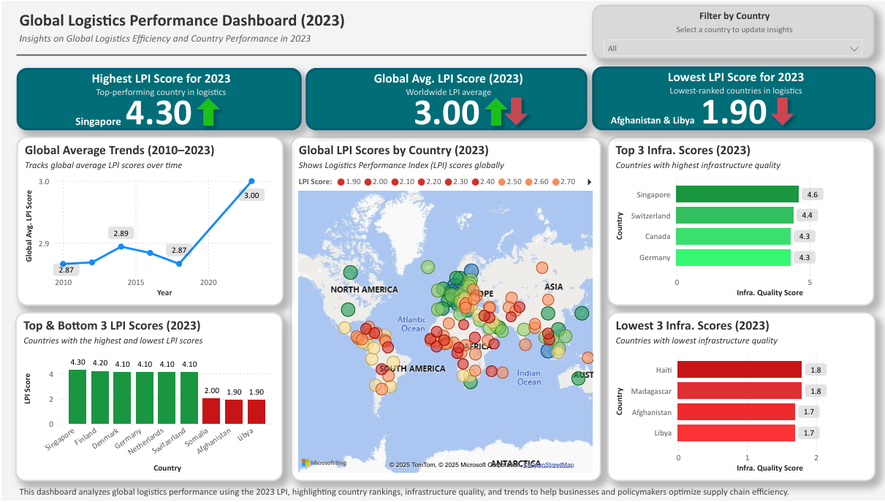

# Global Logistics Performance Dashboard | SQL + Power BI  

_Note: Also listed as “Global Logistics Performance Dashboard” on my resume and LinkedIn profile._

 
 
 
 
 

This project analyzes international logistics capabilities based on the World Bank's Logistics Performance Index (LPI). It highlights year-over-year trade efficiency trends and regional infrastructure gaps using SQL and Power BI.

---

## 📚 Table of Contents
- [Objectives](#objectives-)
- [Tools Used](#tools-used-)
- [Key Insights](#key-insights-)
- [Dashboard Preview](#dashboard-preview-)
- [Report_Access](#report-access-)
- [Project Files & Instructions](#project-files--instructions-)
- [Conclusion & Recommendations](#conclusion--recommendations-)
- [Final Thoughts](#final-thoughts-)

---

## Objectives 🎯
- Evaluate global logistics infrastructure performance from 2010 to 2023.
- Identify countries with the strongest and weakest logistics scores.
- Recommend regional improvements for trade optimization.

---

## Tools & Technologies 🛠️
| Tool        | Use Case                                      |
|-------------|-----------------------------------------------|
| **SQL**     | Data queries, segmentation, filtering         |
| **Power BI**| KPI dashboards, reporting, visuals            |
| **Excel**   | Data cleaning, transformation, metrics        |

---

## Key Insights 📈
- **Top performers**: Germany, Singapore, Netherlands led in infrastructure & customs.
- **Bottom 5 LPI countries averaged <45% in customs scores**, delaying shipments by 6+ days.  
- **LPI Global Trend**: Overall improvement in LPI from 2010 to 2023.
- **Customs & Timeliness** were most volatile dimensions year-over-year.

---

## Report Access 📄

- [📄 View Final Report (PDF)](./Logistics_Performance_Analysis_Report.pdf)
- [📄 View SQL Queries](./logistics_analysis_queries.sql)

---

## Project Files & Instructions 📂

| File Name                                   | Description                                                            |
|--------------------------------------------|------------------------------------------------------------------------|
| `Logistics_Performance_Analysis_Report.docx`| Final project report with insights & recommendations                   |
| `Logistics_Performance_Analysis_Report.pdf` | Final project report with insights & recommendations                   |
| `Logistics_Performance_Dashboard.pbix`      | Power BI dashboard for visualizing LPI trends                         |
| `Logistics_Performance_Dashboard.png`       | Static image preview of the Power BI dashboard                         |
| `Cleaned_Logistics_Dataset.xlsx`            | Cleaned dataset used for analysis (Excel format)                       |
| `Cleaned_Logistics_Dataset.csv`             | Cleaned dataset in CSV format                                          |
| `logistics_analysis_queries.sql`            | SQL queries used in the analysis                                       |
| `README_Logistics_Performance_Analysis.md`  | This README file                                                       |

---

## Conclusion & Recommendations 💡
- **Prioritize Infrastructure Investment**: Focus on low-performing countries with poor LPI customs scores.
- **Streamline Border Procedures**: Enhance customs clearance and reduce time-to-ship delays.
- **Leverage Global Leaders**: Model supply chain policies after top LPI-ranked nations.

---

## Final Thoughts 📝
This project reflects competencies required by **Operations Analysts** and **Business Analysts**, with a global perspective on performance benchmarking, KPI tracking, and regional improvement planning using data tools.

> ⚠️ This project is part of a business-focused analytics portfolio designed to support CRM, operations, and BI roles. For more projects, visit my main GitHub portfolio.
