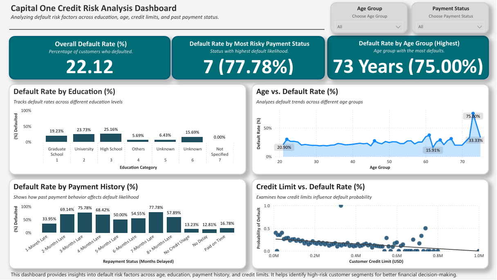

# Capital One Credit Risk & CRM Segmentation Dashboard | SQL + Power BI

_Note: Also listed as “Capital One Credit Risk & CRM Segmentation Dashboard” on my resume and LinkedIn profile._

 
 
 
 
 

This project simulates how Capital One might evaluate the likelihood of customer default based on repayment history, credit limits, and demographics. SQL and Power BI were used to build insights that support risk mitigation strategies in consumer lending.

---

## 📚 Table of Contents
- [Objectives](#objectives-)
- [Tools Used](#tools-used-)
- [Key Insights](#key-insights-)
- [Report_Access](#report-access-)
- [Project Files & Instructions](#project-files--instructions-)
- [Conclusion & Recommendations](#conclusion--recommendations-)
- [Final Thoughts](#final-thoughts-)

---

## Objectives 🎯
- Analyze repayment behavior and key risk indicators.
- Identify customer segments with higher default probability.
- Help credit teams make informed lending decisions.

---

## Tools & Technologies 🛠️
| Tool        | Use Case                                      |
|-------------|-----------------------------------------------|
| **SQL**     | Data queries, segmentation, filtering         |
| **Power BI**| KPI dashboards, reporting, visuals            |
| **Excel**   | Data cleaning, transformation, metrics        |

---

## Key Insights 📈
- **Default Rate**: ~22% of customers defaulted on payments.
- **High Risk Factors**: Customers with payment delay codes (PAY_0 >= 2).
- **Age Group**: Customers around 73 years had the highest default rate (75%).
- **Credit Limits** Higher limits generally lowered default risk, but some high-credit customers still defaulted.

---

## Report Access 📄
- [📄 View Final Report (PDF)](./CapitalOne_CreditRisk_Analysis_Report.pdf)
- [📄 View SQL Queries](./CapitalOne_CreditRisk_SQLQueries.sql)

---

## Project Files & Instructions 📂

| File Name                                          | Description                                                            |
|----------------------------------------------------|------------------------------------------------------------------------|
| `CapitalOne_CreditRisk_Analysis_Report.docx`       | Final project report with insights & recommendations                   |
| `CapitalOne_CreditRisk_Analysis_Report.pdf`        | Final project report with insights & recommendations                   |
| `CapitalOne_CreditRisk_Dashboard.pbix`             | Power BI dashboard for credit default insights                         |
| `CapitalOne_CreditRisk_Dashboard.png`              | Static image preview of the Power BI dashboard                         |
| `CapitalOne_CreditRisk_CleanedDataset.xlsx`        | Cleaned dataset used for analysis (Excel format)                       |
| `CapitalOne_CreditRisk_CleanedDataset.csv`         | Cleaned dataset in CSV format                                          |
| `CapitalOne_CreditRisk_SQLQueries.sql`             | SQL queries used in the analysis                                       |
| `README_CapitalOne_CreditRisk.md`                  | This README file                                                       |

---

## Conclusion & Recommendations 💡
- **Target Age & Repayment Risk**: Monitor age groups with high risk and repeated late payments.
- **Refine Credit Strategies**: Align credit limits with repayment history to manage exposure.
- **Implement Early Intervention**: Use PAY_0 flags to trigger proactive outreach.
- **Automate Risk Flagging**: Use SQL conditions to dynamically flag high-risk customers in real time. This enables credit teams to prioritize early intervention and integrate risk signals into BI dashboards.

---

## Final Thoughts 📝
This project demonstrates essential skills for **CRM Specialists**, **Business Analysts**, and **Risk Analysts** by transforming credit repayment data into actionable insights. It supports predictive decisions through structured SQL queries and a professional Power BI dashboard.

> ⚠️ This project is part of a business-focused analytics portfolio designed to support CRM, operations, and BI roles. For more projects, visit my main GitHub portfolio.
