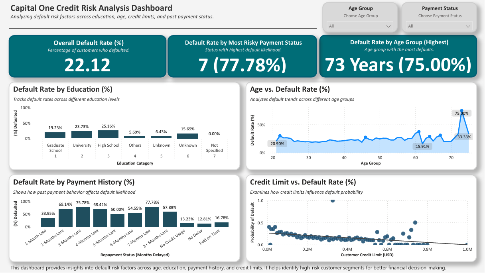

# Lyle Cory Miller – Business, CRM & Systems Analyst Portfolio

📌 *This repository serves as a curated portfolio overview, pinned alongside 4 individual project repositories. Each project includes full documentation, dashboards, and real-world business insights. Designed for Business, CRM, BI, and Systems Analyst roles.*


👋 Hi, I’m **Lyle Cory Miller** — a Business & Systems Analyst with a passion for using data to drive better business decisions. TThis portfolio showcases real-world projects that reflect challenges in operations, customer experience, CRM, and financial risk. I approach problems with structured thinking, SQL-powered analysis, and professional dashboards to deliver insights that matter.

---

## 📚 Table of Contents
- [About Me](#about-me-)
- [Portfolio Overview](#portfolio-overview-)
- [Key Skills Demonstrated](#key-skills-demonstrated-)
- [Focus Areas & Target Roles](#focus-areas--target-roles-)
- [Tools & Technologies](#tools--technologies-)
- [Featured Project – Capital One Credit Risk Analysis](#featured-project--capital-one-credit-risk-analysis-)
- [Full Project List](#full-project-list-)
- [Repository Structure](#repository-structure-)
- [Dataset Sources](#dataset-sources-)
- [Resume & Contact](#resume--contact-)
- [Final Thoughts](#final-thoughts-)

---

## About Me 📌
I am a **Business and Operations Analyst** with a **Bachelor of Business Administration in Information Systems** from **Florida International University (FIU)**. My focus is on solving business problems through systems thinking, performance optimization, and data-supported strategy.

This portfolio reflects realistic challenges aligned with roles in **business analysis**, **system performance**, **CRM support**, and **operational intelligence**.

📜 **Certifications**:
📌 Google Data Analytics Professional Certificate  
📌 Google Project Management Professional Certificate  
📌 Agile Project Management – LinkedIn Learning  
📌 Business Analysis – LinkedIn Learning  
📌 SQL, Power BI, and Data Visualization – LinkedIn Learning

---

## Portfolio Overview 🧠
This repository features **real-world analysis projects** that reflect common challenges in business operations, systems support, financial risk, and global logistics. Each project leverages tools such as **SQL, Power BI, Tableau, and Excel** to deliver professional-grade insights aligned with hiring manager expectations.

---

## Key Skills Demonstrated 📌
- **KPI Reporting & Visualization** – Clear, executive-ready dashboards
- **SQL Segmentation & Trend Analysis** – Practical queries for insight extraction
- **Process & System Optimization** – Identifying inefficiencies and improvements
- **Business Decision Support** – Translating data into actionable strategy

---

## Focus Areas & Target Roles 💼
This portfolio reflects the expectations of **entry-level and junior analyst roles**, with strong alignment to:

- **Business Analyst** – Insight generation, executive reporting, opportunity analysis
- **Operations Analyst** – Process optimization, service performance tracking
- **Systems Analyst** – IT & business alignment, help desk data, root-cause support
- **CRM Analyst** – Customer behavior trends, retention insight, channel performance
- **Business Intelligence (BI) Analyst** – Dashboard development, reporting, SQL analysis

---

## Tools & Technologies 🛠️
| Tool        | Use Case                                      |
|-------------|-----------------------------------------------|
| **SQL**     | Data queries, segmentation, filtering         |
| **Power BI**| KPI dashboards, reporting, visuals            |
| **Tableau** | Data storytelling, service insights           |
| **Excel**   | Data cleaning, transformation, metrics        |

---

## Featured Project – Capital One Credit Risk Analysis 📌
An exploration of customer default behavior based on demographics and payment patterns.

📊 Dashboard Preview:  


Report Access:
📄 [View Full Report (PDF)](./Project-4-Capital-One-Credit-Risk-Analysis/CapitalOne_CreditRisk_Analysis_Report.pdf) 

SQL Access:
🧮 [View SQL Queries](./Project-4-Capital-One-Credit-Risk-Analysis/CapitalOne_CreditRisk_SQLQueries.sql)  

Project Folder:
🔗 [View Full Project Folder](./Project-4-Capital-One-Credit-Risk-Analysis)

---

## Full Project List 📂
### `1️⃣ Sales & Returns Performance Analysis`
_Note: Also listed as “Sales Returns Strategy & Profitability Dashboard” on my resume and LinkedIn profile._

- **Objective**: Assessed sales trends and return rates to reduce losses and improve profit margins.
- **Key Tools**: Excel, Tableau
- **Key Insights**: High-return products, $23K profit loss, 8% return rate

📊 View Project Dashboard → [Dashboard](./Project-1-Sales-Performance-Analysis/Sales_Returns_Analysis_Dashboard.png)  
📄 View Project Report → [Report (PDF)](./Project-1-Sales-Performance-Analysis/Sales_Returns_Performance_Analysis_Report.pdf)  
📁 View Project Folder → [Project Folder](./Project-1-Sales-Performance-Analysis)

### `2️⃣ IT Help Desk & Ticketing System Analysis`
_Note: Also listed as “IT Workflow & KPI Optimization” on my resume and LinkedIn profile._

- **Objective**: Evaluated IT support performance and identified areas of delay across ticket channels.
- **Key Tools**: Excel, SQL, Tableau
- **Key Insights**: 49.6% resolution rate, delays from pending customer responses, medium/critical overload

📊 View Project Dashboard → [Dashboard](./Project-2-IT-Helpdesk-Analysis/IT_Helpdesk_Analysis_Dashboard.png)  
📄 View Project Report → [Report (PDF)](./Project-2-IT-Helpdesk-Analysis/IT_Helpdesk_Performance_Analysis_Report.pdf)  
📁 View Project Folder → [Project Folder](./Project-2-IT-Helpdesk-Analysis)

### `3️⃣ Global Logistics Performance Analysis`
_Note: Also listed as “Global Logistics Performance Dashboard” on my resume and LinkedIn profile._

- **Objective**: Analyzed global LPI scores from 2010–2023 to assess trade infrastructure.
- **Key Tools**: Excel, SQL, Power BI
- **Key Insights**: Top/Bottom countries, infrastructure quality gaps, global LPI improvement

📊 View Project Dashboard → [Dashboard](./Project-3-Global-Logistics-Performance/Logistics_Performance_Dashboard.png)  
📄 View Project Report → [Report (PDF)](./Project-3-Global-Logistics-Performance/Logistics_Performance_Analysis_Report.pdf)  
🧮 View Project SQL → [SQL File](./Project-3-Global-Logistics-Performance/logistics_analysis_queries.sql)  
📁 View Project Folder → [Project Folder](./Project-3-Global-Logistics-Performance)

### `4️⃣ Capital One Credit Risk Analysis`
_Note: Also listed as “Capital One Credit Risk & CRM Segmentation Dashboard” on my resume and LinkedIn profile._

- **Objective**: Analyzed customer default patterns using financial and demographic indicators.
- **Key Tools**: Excel, SQL, Power BI
- **Key Insights**: Default risks by education/age/payment status, credit limits vs risk

📊 View Project Dashboard → [Dashboard](./Project-4-Capital-One-Credit-Risk-Analysis/CapitalOne_CreditRisk_Dashboard.png)  
📄 View Project Report → [Report (PDF)](./Project-4-Capital-One-Credit-Risk-Analysis/CapitalOne_CreditRisk_Analysis_Report.pdf)  
🧮 View Project SQL → [SQL File](./Project-4-Capital-One-Credit-Risk-Analysis/CapitalOne_CreditRisk_SQLQueries.sql)  
📁 View Project Folder → [Project Folder](./Project-4-Capital-One-Credit-Risk-Analysis)

---

## Repository Structure 📁
```
Portfolio-Projects
│
├── 📁 Project-1-Sales-Performance-Analysis
├── 📁 Project-2-IT-Helpdesk-Analysis
├── 📁 Project-3-Global-Logistics-Performance
├── 📁 Project-4-Capital-One-Credit-Risk-Analysis
└── README.md (Main Portfolio Overview)
```
---

## Dataset Sources 📌
- [Sample - Superstore Sales Dataset (Tableau)](https://www.tableau.com/sites/default/files/2021-05/Sample%20-%20Superstore.xls)
- [Customer Support Ticket Dataset (Kaggle)](https://www.kaggle.com/datasets/suraj520/customer-support-ticket-dataset)
- [World Bank Logistics Performance Index (LPI)](https://lpi.worldbank.org/international)
- [Default of Credit Card Clients (UCI Repository)](https://archive.ics.uci.edu/dataset/350/default+of+credit+card+clients)

---

## Resume & Contact 📄
📄 [Download My Resume (PDF)](https://github.com/user-attachments/files/20004971/Lyle_Miller_Resume_General_2025.pdf)
🔗 [Connect on LinkedIn](https://www.linkedin.com/in/lylecorymiller)  
📧 lylecmiller.work@gmail.com

---

## Final Thoughts 📝
Thanks for visiting! Feel free to connect on [LinkedIn](https://www.linkedin.com/in/lylecorymiller) or explore the live version of my portfolio:

🌐 [lylecorymiller.carrd.co](https://lylecorymiller.carrd.co)

> ⚠️ **Note**: This repository is pinned as a portfolio overview alongside 4 individual project repositories. For best viewing, visit the featured dashboards and full case study documentation.
